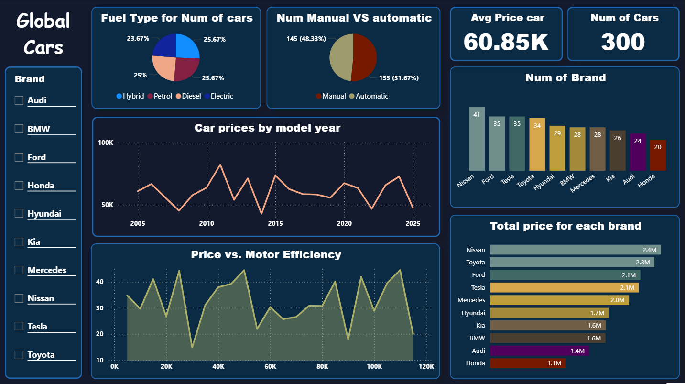
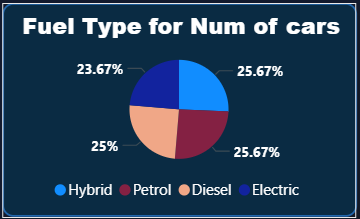
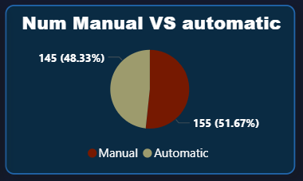
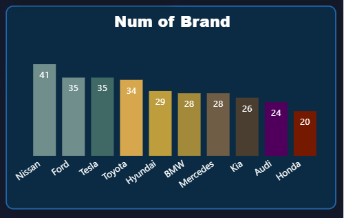
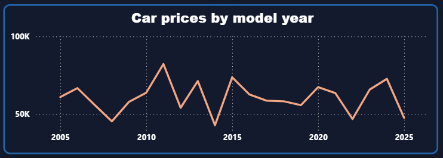
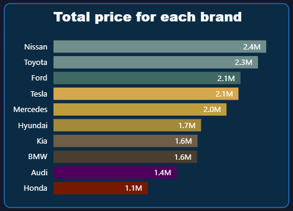

# Global-Cars-Dashborad
Dashboard for global car data
## Dashboard Visualizations

<!-- 
 
-->

لوحة تحكم تفاعلية لبيانات السيارات العالمية مبنية باستخدام **Power BI**.

### الهدف من المشروع
تقديم تحليل بصري واضح وسهل الفهم لسوق السيارات من خلال:
- مقارنة الماركات
- توزيع أنواع الوقود
- نسبة اليدوي والأوتوماتيك
- تطور الأسعار عبر السنين
- علاقة السعر بكفاءة المحرك
- إجمالي القيمة المالية لكل ماركة

## المميزات الرئيسية
- توزيع أنواع الوقود (بنزين – ديزل – هجين – كهربائي)
- مقارنة الناقل اليدوي مقابل الأوتوماتيك
- متوسط سعر السيارة الكلي + إجمالي عدد السيارات
- عدد السيارات لكل ماركة
- تطور أسعار السيارات حسب سنة الصنع
- علاقة السعر بكفاءة المحرك (Price vs Motor Efficiency)
- إجمالي القيمة المالية لكل براند

## Visualizations

- **Pie Chart** → توزيع أنواع الوقود

- **Pie Chart** → نسبة Manual vs Automatic  

- **Cards** → متوسط السعر السيارة + عدد السيارات  

  

- **Colunm Chart** → عدد السيارات لكل ماركة  
 

- **Line Chart** → أسعار السيارات عبر السنين  
 

- **Area Chart** → السعر مقابل كفاءة المحرك  
 

- **Bar Chart** → إجمالي القيمة لكل براند
 
## البيانات المستخدمة
- الملف: `global_cars_dataset.csv` 
- عدد السجلات: حوالي 300 سيارة داخل معرض
- الأعمدة الرئيسية:
  - Brand
  - Manufacture_Year
  - Body_Type
  - Fuel_Type
  - Transmission
  - Engine_CC
  - Horsepower
  - Mileage_km_per_liter
  - Price_USD
  - Car_ID (وغيرها)
